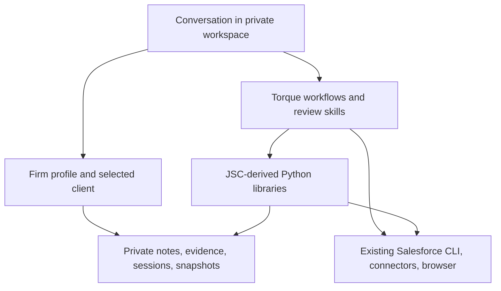

# The Torque continuation

## Product decision

JusticeserverClaude is the foundation. Its repeated real-world use is the reason
to preserve its broad conversational workflow and reusable implementations.
Torque provides the continuing public project name and selected advisory ideas.
This is a direct generalization of JSC, rather than a new interface that requires
the consultant to change how they work.

The default experience is an assistant operating inside a private workspace.
It loads firm/client context, investigates, prepares and executes authorized
work through normal tools, checks outcomes, and saves a useful handoff. The CLI
provides deterministic context, routing, analysis, and recovery helpers.

## Architecture

The public distribution contains generic code, workflows, packaged reference
data, and synthetic examples. Private workspaces contain firm instructions,
client records, org aliases, retrieved metadata, meeting material, and recovery
artifacts. Credentials remain with the existing host/Salesforce tools.

### Continuity choices

| JSC capability | Treatment in Torque |
|---|---|
| Daily conversational commands | All 42 names mapped; generic recipes and new context/session helpers |
| Client context and ongoing memory | Explicit firm/client workspace, local session journal, handoff, retained lesson engine |
| Org investigation and architecture | Existing CLI/connectors plus advisory, Flow and schema review skills |
| Deployment, data changes, migrations | Guided execution and retained optional snapshot/recovery wrappers |
| QA, browser, logs, test scaffolds | Existing generic engines ported; client test flows supplied privately |
| Meeting processing and AI regression | Generic engines retained; media dependencies optional |
| Managed package, customer data, pricing, Trello | Context that belongs in the relevant private environment |
| Torque shell shields, shims, approval tokens | Removed from the default product; no new global registrations |
| JSC technical review subagents | Six concise, model-neutral role definitions |

Workflow coverage is not runtime verification. A guided `connect-org` recipe is
usable through the agent and existing Salesforce CLI; it is not a new Torque
authentication service. A probe generator produces a starting test, not proof
of a business rule. A user-entered `verified` journal status is identified as an
assertion, not silently promoted to observed evidence.

## Firm and client context

Use one workspace per firm and one client directory per engagement. The
BackOffice Thinking profile is an editable starting point for discovery,
solution design, configuration, testing, support, and handoffs. It does not
claim to encode their actual policies or imply employer approval of this tool.

Choose an explicit client for context and an explicit org for execution. Normal
Salesforce authentication and the user's task authorization remain in effect.
There is no separate Torque permission ceremony. Existing platform limits and
meaningful checks in optional execution wrappers still apply.

Private workspaces are a context organization boundary, not an operating-system
sandbox: the assistant and tools retain the filesystem access their host grants.
Do not treat folders or a `.gitignore` as a complete data-loss-prevention system.

## Migration and versioning

Version 2.0.0a1 replaces the old Torque source tree. The legacy implementation
and uncommitted work were preserved before replacement in a private recovery
checkpoint; the Git history remains intact. This does not alter old global
installations, other repositories, or live orgs.

The `jsc_*` import namespaces intentionally remain. Renaming every mature module
would add churn with little user benefit. Package-specific compatibility CLI
entry points are available along with `torque` delegates.

Do not copy a JSC `local/` directory wholesale into a new employer workspace.
Initialize clean firm/client context and bring only relevant, deliberately
selected material into that private environment. There is no customer migration
required to adopt the new runtime.

## Next validation before routine live use

Alpha 2 has completed a bounded live metadata/data/recovery exercise. See
[validation](validation.md) and [the next representative scenario](live-acceptance.md).
The broader consulting workflow remains the next test:

1. Choose a sandbox and one representative client task.
2. Run the existing daily workflow end to end: resume, investigate, change,
   validate, execute, verify as the intended user, and hand off.
3. Exercise a limited snapshot/recovery case and inspect the actual restored
   values; document unsupported fields and operations.
4. Measure task time, repeated context requests, unnecessary interruptions,
   and corrections. Adjust concrete friction found during use.

These exercises determine operational confidence and the employer pilot story.
They are separate from the offline packaging and regression checks for this alpha.
No specific build deadline or employer rollout date is assumed.
